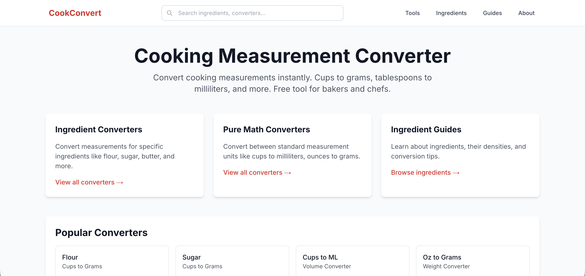
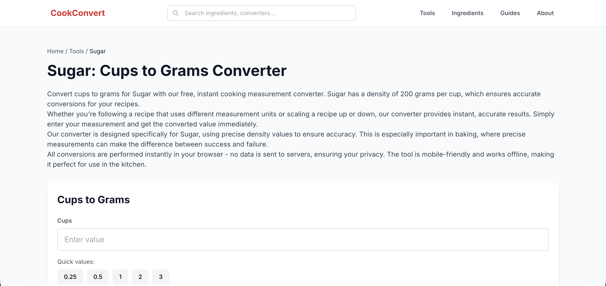

# CookConvert

**Live Demo:** https://cookconvertapp.com/

A static cooking measurement converter website built with Next.js. Convert between cups, grams, tablespoons, milliliters, and ounces—with ingredient-specific tools (e.g. flour, sugar) and pure unit converters. No backend; all data lives in code and pages are generated at build time.

## Screenshot

### Homepage


### Converter page


## Features

- **Ingredient converters** — Cups to grams, grams to cups, tablespoons to grams for every ingredient in the registry.
- **Pure unit converters** — Cups ↔ ml, oz ↔ grams, tbsp/ml, tsp/ml.
- **Ingredient guide pages** — One page per ingredient with density (g/cup), conversion table, and tips.
- **Query-style pages** — Pre-rendered pages for specific queries (e.g. “200g flour to cups”).
- **Client-side search** — Search converter and ingredient pages from the header (no server).
- **Static export** — Full static site; build outputs the `out/` directory. No runtime server.

## Tech stack

- Next.js 14 (App Router)
- TypeScript
- Tailwind CSS
- Static export (`output: 'export'`)

## Project structure

```
cookconvert/
├─ app/          # Next.js routes
├─ components/   # UI and converter components
├─ lib/          # conversion logic, registry, SEO helpers
├─ public/       # static assets
└─ scripts/      # build utilities
```

- **app/** — Routes (homepage, tools, ingredients, converter pages, guides, about/privacy/terms/contact).
- **components/** — Converter, conversion table, FAQ, search, JSON-LD, shared UI.
- **lib/** — `registry.ts` (ingredients + densities), `conversion.ts` (conversion logic), `seo.ts`, `site.ts`, `search.ts`, `utils.ts`.
- **public/** — Static assets and `_redirects` for static hosts.
- **scripts/** — `generate-favicon.js` (runs at prebuild).

## How it works

Ingredients and their densities (grams per cup) are defined in `lib/registry.ts`. Conversion formulas live in `lib/conversion.ts`—density-based for ingredients, fixed constants for pure units (cups/ml, oz/grams). All routes are generated at build time via `generateStaticParams()` from the registry; there is no backend or database. Search builds an in-memory index from the same registry and runs in the browser.

## Installation

```bash
npm install
npm run dev
```

Open [http://localhost:3000](http://localhost:3000).

To produce a static export: `npm run build`. Output goes to `out/`.

## Usage

- **Homepage** — Browse links to tools, ingredients, and popular converters.
- **Convert** — Pick a converter (e.g. cups to grams), choose an ingredient, enter a value; result updates instantly.
- **Search** — Use the header search to find an ingredient or converter page.
- **Ingredient pages** — Open an ingredient from the ingredients hub to see its density, conversion table, and tips.

## Current limitations

- All ingredient data is in `lib/registry.ts`; adding or editing ingredients requires a code change and rebuild.
- Search is client-side only (no server-side or full-text search).
- Ad slot is a placeholder; no real ad integration unless you add it.
- Images are unoptimized (static export); add `/og.png` to `public/` if you want social previews.

## Future improvements

- Add `og.png` for social sharing.
- Expand per-ingredient copy on ingredient guide pages.
- Optional: integrate an ad provider using the existing `AdSlot` component.
- For very large URL counts, consider a sitemap index.
- Add more ingredients to the registry.

## Documentation

Additional technical notes and SEO architecture documents are available in the `docs/` folder.

## License

This project is provided for portfolio and demonstration purposes only.

All rights reserved.

The source code may not be copied, modified, redistributed, or used for commercial purposes without permission from the author.
